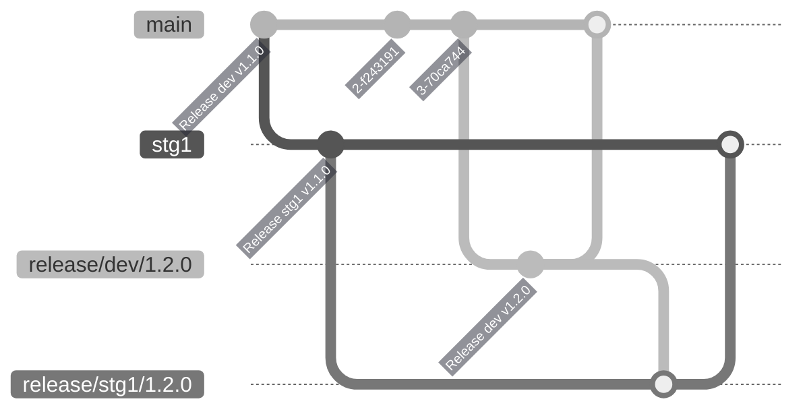

# Splurge Backend

Backend Service for Splurge App.
Splurge is a social network platform that rewards content creators through user-driven economy.

## Installation

1. Install [Node.js and npm](https://www.npmjs.com/get-npm) and [Git](https://git-scm.com/book/en/v2/Getting-Started-Installing-Git).

2. Clone this repo:

   ```bash
   git clone https://gitlab.com/splurge/backend/backend-service.git
   ```

4. Configure [MongoDB](https://www.mongodb.com/cloud) in the cloud or in your local environment.
   Save the connection URL to be used in step 6.

5. This project also uses Redis for caching. You will need a locally running instance of it during development. To install, head over to [Redis Quick Start](https://redis.io/topics/quickstart) to download and install Redis locally.

6. Run [`./init`](./init). This installs the required dependencies and sets up Git commit templates.

   ```bash
   ./init
   ```

8. Update [.env](.env):
   - FIREBASE_PROJECT_ID=<firebase-project-id>
   - FIREBASE_ISSUER=https://securetoken.google.com/<firebase-project-id>
   - FIREBASE_CREDENTIALS=<generated firebase private keys>
   - DB_USERNAME=<db username value from step 3>
   - DB_PASSWORD=<db password value from step 3>
   - DB_DATABASE=<db name from step 3>
   - MONGODB_CONNECTION_URL=<connection url from step 4>

9. Install https://github.com/whitecloakph/changelog-sh

## Running the app

1. To run the app for the first time and everytime there are changes in the migration files, execute these commands:

   ```bash
   $ npm run build
   $ npm run typeorm -- migration:run
   ```

   Followed by any of the commands in step 2.

2. If there is no need for any migrations, the app can be ran using any of these command:

   ```bash
   # development
   $ npm run start

   # watch mode
   $ npm run start:dev

   # production mode
   $ npm run start:prod
   ```

## Testing

### Unit Tests

Simply run

```bash
$ npm run test
```

### End-to-End (e2e) Tests

Simply run

```bash
$ npm run test:e2e
```

### Test coverage

To determine the code coverage, run

```bash
$ npm run test:cov
```
<!-- 
## Firebase Authentication

To authenticate to app and generate access token using enabled providers (google, fb, twitter)

**Note:**
Make sure firebase cli is already configured. Refer to [Installation Step 7](#installation)

1.  Clone this repo:

```bash
 $ git clone https://github.com/firebase/quickstart-js.git
```

2. Go to the cloned repository via terminal
3. Navigate to `/auth` folder
   ```bash
    $ cd /auth
   ```
4. Serve the firebase auth app on localhost:5000 (default) using `firebase serve` command
   ```bash
   $ firebase serve
   ```
5. Open the served firebase auth app on **previous step** using your preferred web browser and pick the appropriate sign-in method has been enabled in the Firebase Console authentication panel and sign-in

### Updating CHANGELOG.md
Make sure changelog-sh is already installed. Refer to [Installation Step 9](#installation).

1. For every notable update on the application, add a changelog entry

   ```bash
   change new <changed | added | fixed>
   ```

   Sample:

   ```bash
   change new added [SA-123] BackOffice | Reports | Search users
   ```
2. For every release to QA env, use the changelog-sh to group the entries together.

   3.1. Branch out from master branch:

   `release/dev/<version>`

   3.2. Using changelog-sh, run

    ```bash
    change release <version>
    ```


   3.3. Copy all the changes to the top of CHANGELOG.md file

   Sample:

    ```## [0.1.10]
    ### Added
    - [SA-669] Marketplace | getMomentPriceRange API
    - [SA-685] getOldNotifications API

    ### Changed
    - [SA-671] Notification | Add age field
    - [SA-612] Sort newsfeed items by purchase date desc
    ```

## Optimization
- For optimization MRs, select `Optimization` template for description.
- As much as possible, add the details of optimization including before and after optimization, the steps you made, etc.

## Deployment

### Rule of thumb
- Before deployment:
    - Make sure your working tree is clean. If not, commit or stash all your local changes
- You MUST first deploy to `dev` before deploying to `staging`
- Make sure to apply `stg1` and `stg2` changes to `main` before performing the release script to avoid merge conflicts.
- All hotfixes MUST merge request first to main

### Release Dev-Staging

1. Run release script for Dev and Staging
    ```
    sh release.sh dev-staging <version-name>
    ```
    OR
    ```
    ./release.sh dev-staging <version-name>
    ```

2. Create a merge request to `main` branch from `release/dev/<version-name>` branch
   MR ie. `Bump version v<version-name>`
    - Select `Dev Release` template for description
    - Add latest changes from `CHANGELOG.md` to merge request description
    - Add `dev` and `release` labels to the merge request
3. Create a merge request to `stg1` branch from `release/stg1/<version-name>` branch
   MR ie. `Release stg1 v<version-name>`
    - Select `Staging Release` template for description
    - Add latest changes from `CHANGELOG.md` to merge request description
    - Add `staging` and `release` label to the merge request
    - Move all the `Jira Tickets` in the changelog after deployments
4. Repeat step 3, but this time, create a merge request to `stg2` from `release/stg2/<version-name>` branch.



### Release Production

 **Pre-requisite**: Make sure that **Core Service V2 is already deployed** to `production` or `prod-art` branch if there are changes to be deployed.

1. Checkout and pull from `production` branch
    ```
    git checkout production
    git pull
    ```
2. Create release branch ie. `release/production/<version-name>`
    ```
    git checkout -b release/production/<version-name>
    ```
3. Find the `commit hash` of Staging version you want to release in https://gitlab.com/splurge/backend/backend-service/-/commits/stg1?ref_type=heads?search=Release
4. Merge staging release version
    ```
    git merge <commit-hash>
    ```
    - Copy new release changes from `CHANGELOG.md` to `CHANGELOG_PRODUCTION.md` or `CHANGELOG_PRODUCTION_ART.md` and compile in a single release `<version-name>` and update the date
    - Fix conflicts and add new changes
5. Complete local merge request
6. Create a merge request to `production` branch from `release/production/<version-name>` branch MR ie. `Release to Production - <version-name>`
7. Select `Prod Release` template for description
8. Add changes from either `CHANGELOG_PRODUCTION.md` or `CHANGELOG_PRODUCTION_ART.md` to merge request description
9. Add `release` and `production` labels to the merge request

### Release Hotfix in Production

1. Checkout and pull from `production` branch
    ```
    git checkout production
    git pull
    ```
2. Create release branch ie. `release/production/<version-name>`
    ```
    git checkout -b release/production/<version-name>
    ```
3. Find the `commit hash` in https://gitlab.com/splurge/backend/backend-service/-/commits/main
4. Cherrypick commit
    ```
    git cherry-pick <commit-hash>
    ```
    - If there is a significant merge conflict, ask for help from the author of the commit to cherrypick to the release branch
5. Repeat it for other hotfixes
6. Copy new release changes to either `CHANGELOG_PRODUCTION.md` or `CHANGELOG_PRODUCTION_ART.md`
7. Commit and push the changes with a commit message of `Bump production version to v<version-name>`
8. Create a merge request to `production` branch from `release/production/<version-name>` branch MR ie. `Release production v<version-name>`
9.  Select `Prod Release` template for description
10. Add changes from either `CHANGELOG_PRODUCTION.md` or `CHANGELOG_PRODUCTION_ART.md`to merge request description
11. Add `production`, `release` and `hotfix` label to the merge request
12. Move all the `Jira Tickets` in the changelog after deployments

### Bump Production to Main

1. Checkout and pull from `main` branch
    ```
    git checkout main
    git pull
    ```
2. Create chore branch ie. `chore/bump-production-to-main`
    ```
    git checkout -b chore/bump-production-to-main
    ```
3. Merge production branch to chore branch
    ```
    git merge production
    ```
4. Commit and push the changes
5. Create a merge request to `main` branch from `chore/bump-production-to-main` branch MR ie. `Bump production to main`
6. Add `chore` label to the merge request


## Running the app

```bash
# development
$ npm run start

# watch mode
$ npm run start:dev

# production mode
$ npm run start:prod
```

## Test

```bash
# unit tests
$ npm run test

# e2e tests
$ npm run test:e2e

# test coverage
$ npm run test:cov
```

## Support

Nest is an MIT-licensed open source project. It can grow thanks to the sponsors and support by the amazing backers. If you'd like to join them, please [read more here](https://docs.nestjs.com/support).

## Stay in touch

- Author - [Kamil Myśliwiec](https://kamilmysliwiec.com)
- Website - [https://nestjs.com](https://nestjs.com/)
- Twitter - [@nestframework](https://twitter.com/nestframework)

## License

Nest is [MIT licensed](LICENSE). -->
